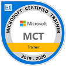
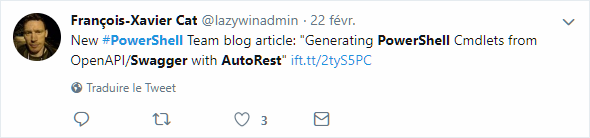
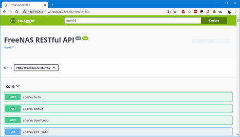
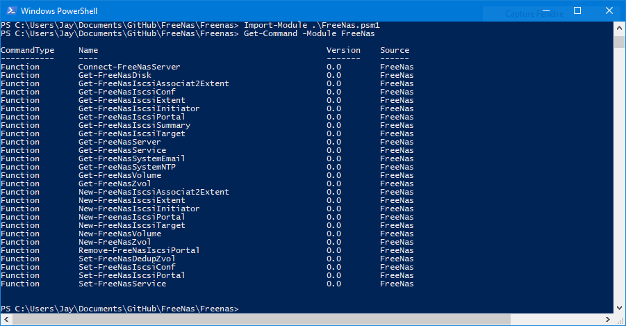

# 1. French PowerShell User Group

  **LightningDemos** 26/02/2019  

* Presentations rapide (10 minutes max).
* Plusieures sujets
* Les demos vous offrent assez pour decouvrir un sujet et vous pointes vers d'autres ressources pour en apprendre plus
 
# AGENDA #

* PowerShell avec Freenas (Jerome Bezet-Torres)
* DBATools (Olivier Miossec)
* BetterCredentials (Laurent Lienhard)
* PSClassUtils (Stephane Van Gulick)

# REJOINDRE LE MEETING #
Youtube en direct: https://www.youtube.com/watch?v=3OR143IPQ4o

# PRESENTER UNE LIGHTNING DEMO #
https://goo.gl/forms/D3GkkSsmGmSrPXaE2


 
Un `Module powershell` pour automatiser la configuration des systèmes **FreeNas** et **TrueNas**.

## 1.1. Qui suis-je

|   |   |
|---|---|
|Formateur Indépendant et consultant   | **Microsoft** (Server, MDT, Client, PowerShell, Cluster, Exchange, Sharepoint...) **VMware** vSphere 5.5 - 6.7U1  |
|Professeur d'informatique BTS SIO Academie de Lyon |    |
|Certifications Editeurs **Microsoft**, **VMware**, **Stormshield**  | MCT, MCSA Server 2016 ,MCP MCTS   |
|Microsoft Trainer depuis 7 ans  |   |  
|Twitter  **@JM2K69**  |[](https://twitter.com/JM2K69)|
|Site Web| [](http://JM2K69.github.io) |

# 2. Présenation de Freenas v1.0

  


* Partage de fichiers
    * SMB
    * CIFS
    * AFP
    * NFS
    * ISCSI
        * VAAI pour VMware [Informations FR](http://vinception.fr/les-primitives-vaai/)
        * ODX pour Microsoft [Informations EN](https://docs.microsoft.com/en-us/windows-hardware/drivers/storage/offloaded-data-transfer)
    * Webdav
* Interface de gestion Web
* Protection des données
    * Système de fichier ZFS [Informations FR](https://fr.wikipedia.org/wiki/ZFS)
    * Raid-Z2 et Raid-Z3 [Informations EN](https://en.wikipedia.org/wiki/Non-standard_RAID_levels#RAID-Z)
* Snapshot
* Réplication
* Plugins

Quelques informations concernant les serveurs certifiés : https://freenas.org/freenas-certified-servers/

## 2.1 Couverture de l'API

Lien Web de l'API v1.0 [api.freenas.org](http://api.freenas.org)

- [X] Configuation global (Partielle)
    - [x] NTP
    - [x] Email
- [x] Stockage
    - [x] Creation
    - [ ] Suppression
    - [x] Mise à jour (Partielle)
- [x] Services
    - [X] Status
- [x] Partages (Partielle)
    - [x] ISCSI
         - [x] Creation
         - [x] Configuration
         - [ ] Suppression
         - [x] Mise à jour (Partielle)

> API V2 Swagger isn't **Feature complete**







## 2.2 Module powershell

Dans cette première version seulement quelques fonctions sont disponnibles, elles sont  orientées autour du Stockages et de la configuration iSCSI.




*Exemples de commandes :*

* **Connexion au Serveur**

```powershell
Connect-FreeNasServer -server '@IPv4' -username 'root' -password 'YourStrongPa$$word!!'
```

* **Création du Volume**

> Merci `@Nicolasb` et `@LxLechat` pour leur aide sur la création du **JSON**

```powershell
        $Obj = [Ordered]@{
            volume_name = $VolumeName
            layout      = @(@{
                    vdevtype = $Vdevtype
                    disks    = $FreenasVolume
                })
        }
```

> VdevType :  [ValidateSet("stripe", "mirror", "raidz", "raidz2", "raidz3")]

```powershell
New-FreeNasVolume -Name 'data' -Vdevtype 'Stripe' -$NbDisks 3 -StartDisksNB 1
```
## 3. Demo Time

* Création de Volumes
* Creation de Volumes **Zvol**
* Confiuration de la depuplication sur un **Zvol**
* Configuration du partage **ISCSI**
    * Portail
    * Initiator
    * Extent
    * Association
* Résumé des informations du services **ISCSI**
* Démarrage du service **ISCSI**
